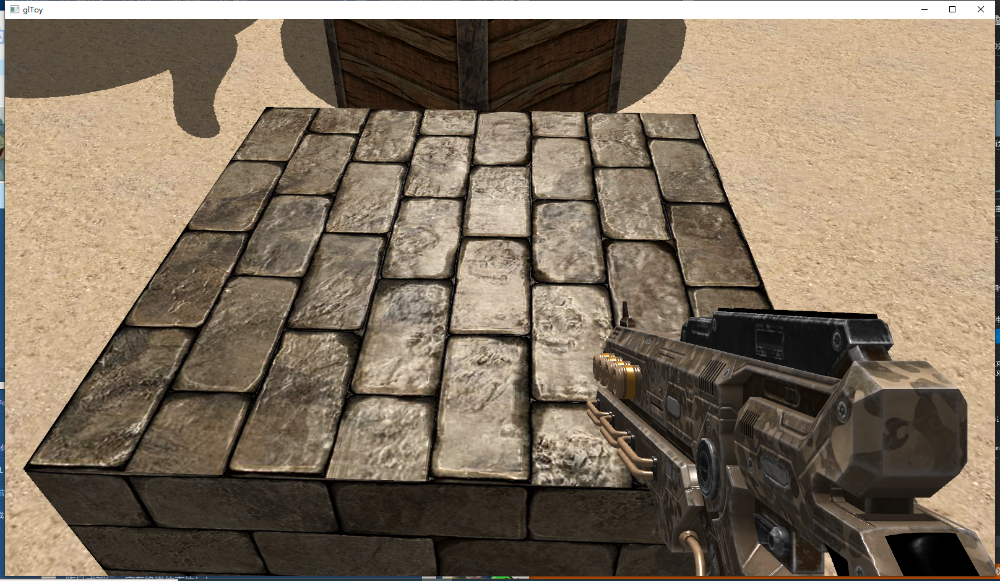

# OpenGL Toy
#### 自娱自乐的玩具

学习参考了[LearnOpenGL CN](https://learnopengl-cn.github.io);

本项目三维模型文件由 https://github.com/mydearyoungsnow/ModelData 生成，自己造的轮子，仅存储了必要的数据并进行了压缩;

自己所写的所有类的声明在[./include/ys](https://github.com/mydearyoungsnow/glToy/tree/master/include/ys)下，实现在[./src](https://github.com/mydearyoungsnow/glToy/tree/master/src)下，程序入口在[./glToy.cpp](https://github.com/mydearyoungsnow/glToy/blob/master/glToy.cpp)内;

OpenGL版本: 4.6

2020/8/14 更新：
新增了下蹲(C)、匍匐(Left Ctrl)、跳跃(Space)、冲刺(Left Shift)(未完善)

